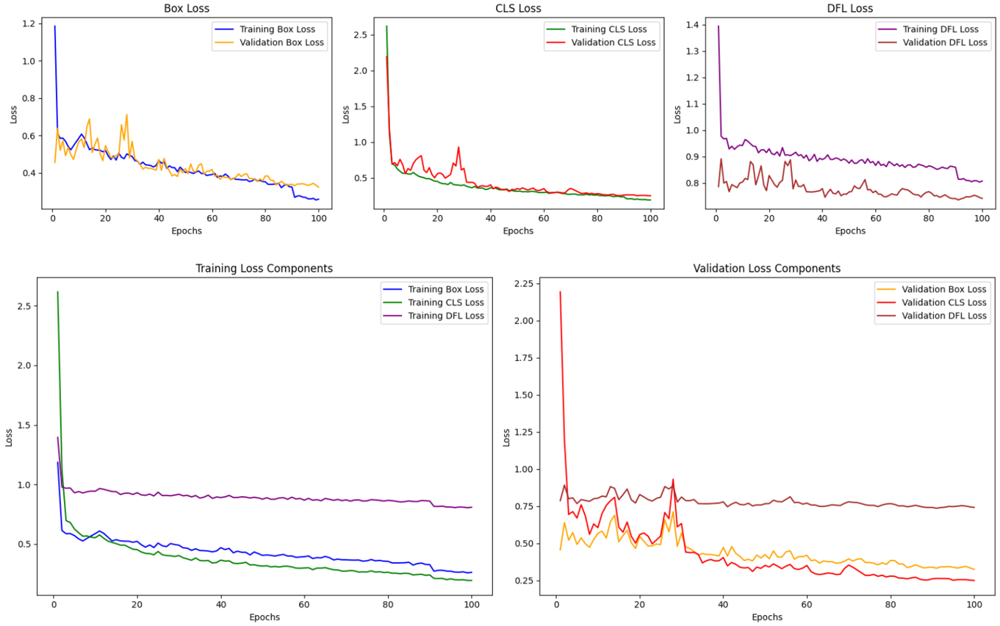

## Enhancing Precision Agriculture with YOLOv8: A Practical Study on Basil Crop Detection

This project delves into the application of YOLOv8, a state-of-the-art object detection model, for real-world use cases in precision agriculture. Here, we focus on automating basil crop identification within agricultural fields. By leveraging a deep learning approach, this project aims to enhance efficiency and accuracy in crop monitoring tasks, empowering farmers with valuable insights.

This readme serves as a comprehensive guide to the project, outlining the methodology, implementation details, and key findings. We'll delve into each step, providing a clear understanding of how the YOLOv8 model was constructed and evaluated for basil crop detection.

### Step-by-Step Guide

**1. Project Setup**

* **Environment:**
    1. Ensure you have Python (version 3.7 or higher) installed on your system.
    2. Set up a virtual environment to manage project dependencies effectively. Tools like `venv` or `conda` can be used. Refer to their documentation for specific instructions.
* **Libraries:**
    1. Install the necessary Python libraries using `pip`:
        * `ultralytics` (the object detection model)
        * `opencv-python` (for image processing)
        * `numpy`, and `matplotlib` (for data processing and visualization)

**2. Data Acquisition/Collection**

* **Basil Crop Dataset:**
    1. The dataset containing images of basil crops in fields. (around 209 images)
    2. The dataset include annotations for each basil plant, typically in the form of bounding boxes around the plants. (in YOLO format)

**3. Data Pre-processing**

* **Resizing Images and Annotations:**
    1. Resizing all the images in the dataset to a uniform size, such as 640 x 480 pixels (YOLOv8 image format).
    2. Adjust the corresponding annotations (bounding boxes) to reflect the resized image dimensions.
* **Data Split:**
    1. Divide your dataset into two distinct subsets: a training set (typically around 80% of the data) and a validation set (remaining 20%).
    2. The training set is used to train the YOLOv8 model, while the validation set is used to evaluate its performance on unseen data.

**4. Model Building**

* **YOLOv8 Model Configuration:**
    1. Utilize the `yolov8` library to configure and build the YOLOv8 model.
    2. Specify the model architecture (e.g., YOLOv8s, YOLOv8m, etc.). (we are using YOLOv8n)
    3. Defining the training parameters such as batch size, learning rate, optimizer, etc.).
    4. Adapt the model to detect basil crops by modifying the class labels. Refer to the `yolov8` documentation for detailed instructions.
* **Training:**
    1. Train the YOLOv8 model using the prepared training dataset.
    2. The model learns to identify basil crops within the images based on the provided annotations.
    3. Training typically involves iterating through the training data multiple times.

**5. Model Evaluation**

* **Performance Metrics:**
    1. Evaluate the model's performance on the validation set using metrics like:
        * Mean Average Precision (mAP) at different IoU thresholds.
        * Precision and Recall.
        * F1 Score.
    2. Analyze training and validation loss values (box loss and classification loss).

**6. Inference and Visualization**

**Validation Results on Evaluation Metrics**

| Metric    | Precision | Recall | F1 Score | mAP50 | mAP50-95 |
|-----------|-----------|--------|----------|-------|----------|
| Result    | 0.960     | 0.987  | 0.969    | 0.983 | 0.895    |

The above concise table summarizes the major validation metrics, highlighting the model's precision, recall, F1 Score, mAP50, and mAP50-95 results. These metrics collectively attest to the YOLOv8 model's exceptional performance in basil crop detection, underpinning the core findings of your research.

**Validation Results on Bounding Boxes**

| Metric                | Train | Validation |
|-----------------------|-------|------------|
| Box Loss              | 0.428 | 0.435      |
| Classification Loss   | 0.377 | 0.435      |
| DFL Loss              | 0.891 | 0.778      |

The below table succinctly summarizes the training and validation losses, which are vital indicators of your YOLOv8 model's performance. These results provide insights into the efficiency of the model in terms of making predictions that closely align with the ground truth annotations.

In our study of basil crop detection with YOLOv8, we meticulously track the evolution of box losses, classification (cls) losses, and deformable (dfl) losses during the training and validation phases. The significance of these loss metrics lies in their ability to quantify various aspects of our model's performance. Train and validation box losses reflect the model's capacity to accurately localize basil crops within images, guiding the refinement of bounding box coordinates. Simultaneously, train and validation classification losses assess the model's aptitude for correctly categorizing basil crops, ensuring their distinction from background elements. Furthermore, the inclusion of deformable losses adds a layer of spatial adaptability, essential for handling the diverse growth stages and orientations of basil crops in the real-world context. By continuously monitoring these losses, we gain a nuanced perspective of our YOLOv8 model's precision and resilience, underscoring its suitability for the demanding realm of precision agriculture.

These loss metrics serve as fundamental pillars in our quest to optimize the YOLOv8 model for basil crop detection. They encapsulate the model's ability to precisely localize and classify basil crops, and the unique deformable losses enhance its spatial awareness. As we delve into the validation results, these losses provide granular insights into the model's accuracy and robustness, reinforcing its practical viability in real-world precision agriculture scenarios.

<figure>
  
  <figcaption>Figure: Model Loss evalution over Epochs</figcaption>
</figure>

## Conclusion

This project successfully demonstrated the potential of YOLOv8 for automating basil crop detection in precision agriculture applications. The model achieved excellent performance metrics on the validation set, indicating its ability to accurately identify basil crops within diverse field conditions. By leveraging this technology, farmers can gain valuable insights into crop health and distribution, enabling them to optimize resource allocation and improve overall agricultural efficiency.

Future work could involve exploring different YOLOv8 model architectures, experimenting with data augmentation techniques, and deploying the model on mobile platforms for real-time field monitoring.
